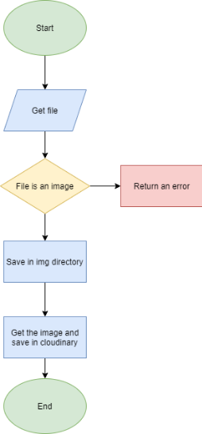

# Image Uploader API

An API for an application where you can storage your images in the cloud. [Here is the fronted of this Application](https://github.com/rogeliosamuel621/Image-Uploader)



## Built with

- Node.js with typescript
- File manage with multer
- Cloud storage in [Cloudinary](https://cloudinary.com/)

## Getting started

### Install dependencies

```
npm install
```

### Development

```
npm run dev
```

### Production

```
npm run build

npm run production
```

## Resources

- [Multer docs](https://www.npmjs.com/package/multer)
- [Como subir archivos con el módulo multer Node.j](https:eladiorochameprogramacioncomo-subir-archivos-con-el-modulo-multer-node-js)
- [Cloudinary docs](https://cloudinary.com/documentation/node_integration)
- [Sample projects cloudinary_npm](https://github.com/cloudinary/cloudinary_npm/tree/master/samples)
- [Satck overflow answer](https://stackoverflow.com/questions/38652848/filter-files-on-the-basis-of-extension-using-multer-in-express-js)

- [Why are my file uploads missing deleted](https://help.heroku.com/K1PPS2WM/why-are-my-file-uploads-missing-deleted)
- [StackOverflow](https://stackoverflow.com/questions/53649484/heroku-error-enoent-no-such-file-or-directory-stat-app-dist-index-html)
- [One off dynos](https://devcenter.heroku.com/articles/one-off-dynos)
- [Error H18 in Heroku](https://help.heroku.com/18NDWDW0/debugging-h18-server-request-interrupted-errors-in-nodejs-applications)

## Experience building this project

I had too many problems Deploying these apps to heroku and netlify, I made like 40 commits just to solving problems, but finally, my apps work correctly.

I learned too much because never before I had worked with images in node.js and never before I had Deployed an API in heroku.

### I learned

- Manage files with Node.js
- Save images in host [Cloudinary](https://cloudinary.com)
- Deploy an API in heroku
- Give style to input type file
- Make a loader

## License

[MIT](https://choosealicense.com/licenses/mit/)
